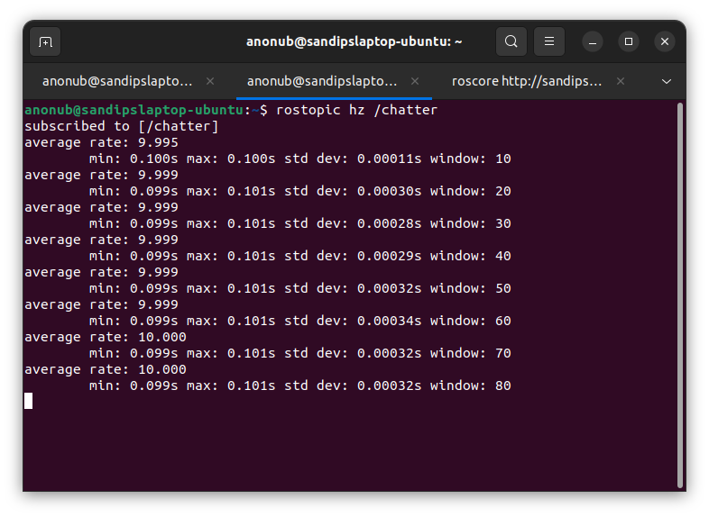
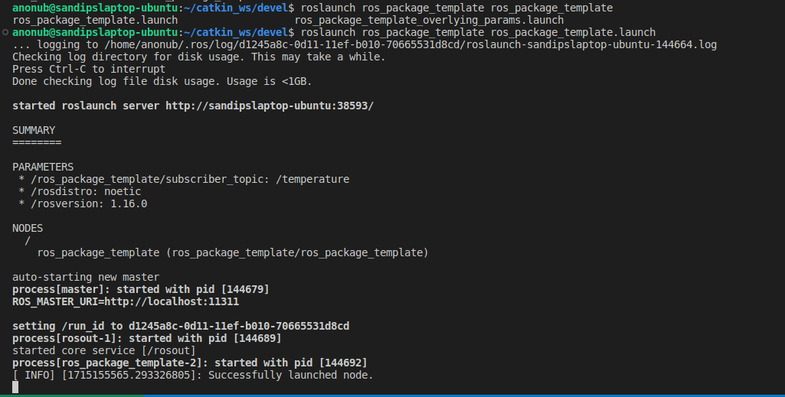

# Course 1

## Lecture Notes for Course 1

The very basic ROS Commands(ROS Master, Nodes, Topics):

```bash
#ROS Master
#Starting a ROS Master
roscore

#ROS Nodes
#Run a ROS Node
rosrun <package_name> <node_name>
#See the list of all the Active Nodes
rosnode list
#Info about a Node
rosnode info <node_name>

#ROS Topics
#List of active topics
rostopic list
#Print the messages being published to a topic
rostopic echo /<topic>
#Info about a topic
rostopic info /<topic>
#Analyze the frequency of messages published to a topic
rostopic hz /<topic>

#ROS Messages
#each topic has a unique 'type' of message associated with it
#each message type is/can be described by a *.msg(much like C/C++ Structures) file
#check the type of a topic
rostopic type /<topic>
#publish a message to a topic
rostopic pub /<topic> <type> <data>
```

Example output of `rostopic hz /chatter` run after running the example C++ talker on another terminal Tab



An example *.msg file(a.k.a. "Message type") composed of simpler message types

```plaintext
#geometry_msgs/PoseStamped.msg

std_msgs/Header header
 uint32 seq
 time stamp
 string frame_id
geometry_msgs/Pose pose
 geometry_msgs/Point position
  float64 x
  float64 y
  float64 z
 geometry_msgs/Quaternion orientation
  float64 x
  float64 y
  float64 z
  float64 w
```

ROS Nodelets: \
Same concepts as ROS Nodes, but reduced communication overhead when running on the same \
machine, although a bit harder to implement

### ROS Workspace Environments and Catkin

```bash
#Loading own Workspace environment
cd /path/to/catkin/ws #typically ~/catkin_ws
source devel/setup.bash
#Checking workspace environment
echo $ROS_PACKAGE_PATH

#Bulding a Workspace
cd /path/to/catkin/ws
catkin build <package_name>
#Older, outdated alternative: catkin_make <package_name>
source devel/setup.bash

#Cleaning catkin workspace
cd /path/to/catkin/ws
catkin clean

#Checking catkin workspace
catkin config
#building Debug instead of Release
catkin build --cmake-args-DCMAKE_BUILD_TYPE=Debug
```

The ROS Launch command

```bash
roslaunch <package_name> <name_of_launchfile>.launch
#With an argument:
roslaunch <package_name> <name_of_launchfile>.launch <arg_name>:=<value>
```

Example output after launching the `ros_package_template` file as instructed in the course



ROS Launch files(typical structure)

```xml
<launch>
    <node name="listener" pkg="roscpp_tutorials" type="listener" output="screen"/>
    <node name="talker" pkg="roscpp_tutorials" type="talker" output="screen"/>
</launch>
```

NOTE:

1. 'output' attribute specifies where to output log messages("screen" means console, "log" means log file)
2. Be careful about the 'self-closing tags'

Another launch file(can be used to launch a World in Gazebo) \
that has launch parameters('arg's) enabled

```xml
<?xml version="1.0"?>
<launch>
  <arg name="use_sim_time" default="true"/>
  <arg name="world" default="gazebo_ros_range"/>
  <arg name="debug" default="false"/>
  <arg name="physics" default="ode"/>

  <group if="$(arg use_sim_time)">
    <param name="/use_sim_time" value="true" />
  </group>

  <include file="$(find gazebo_ros)/launch/empty_world.launch">
    <arg name="world_name" value="$(find gazebo_plugins)/test/test_worlds/$(arg world).world"/>
    <arg name="debug" value="$(arg debug)"/>
    <arg name="physics" value="$(arg physics)"/>
  </include>
</launch>
```

Note:

1. Include other launch files with `<include>`
2. pass arguments to included launch files using `<arg>`
3. `<group>` with `if` attribute can be used as if-statements
4. Use value of arguments as `$(arg <arg_name>)`
5. Find system path to other packages using `$(find <package_name>)`

Running gazebo with provided ROS Interface

```bash
rosrun gazebo_ros gazebo
```
