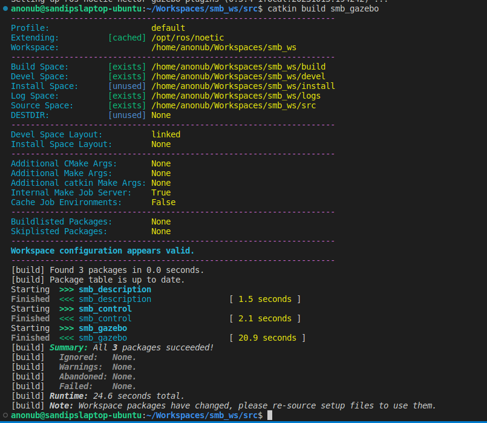
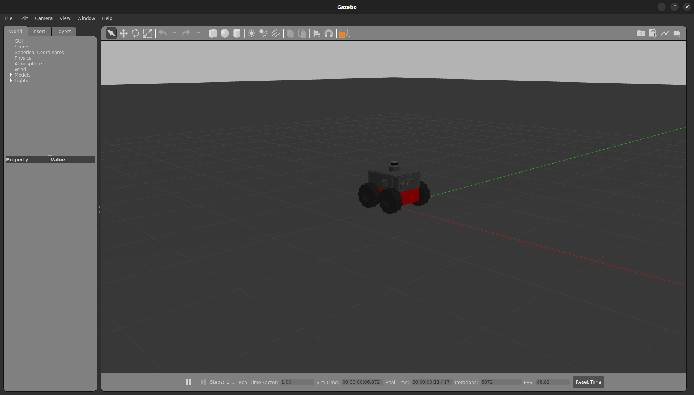
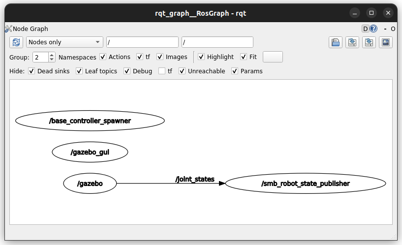
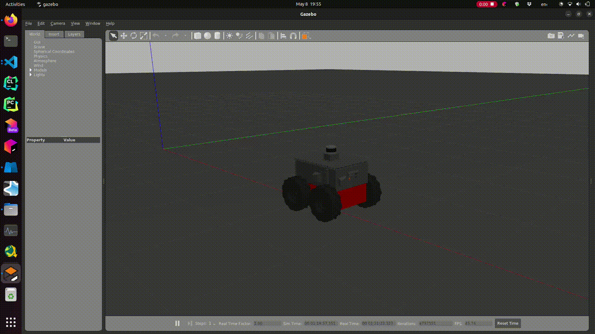
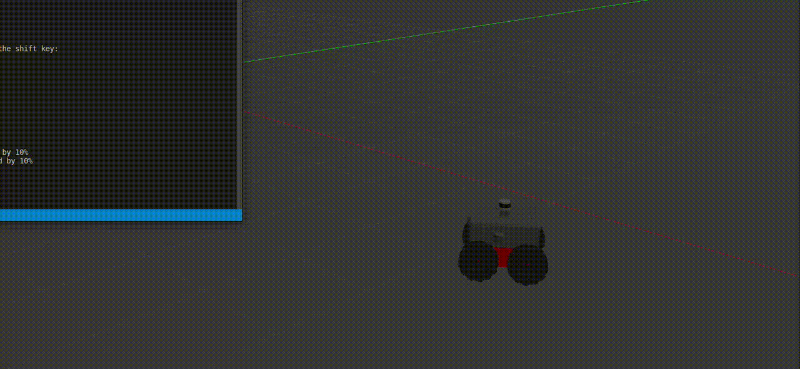
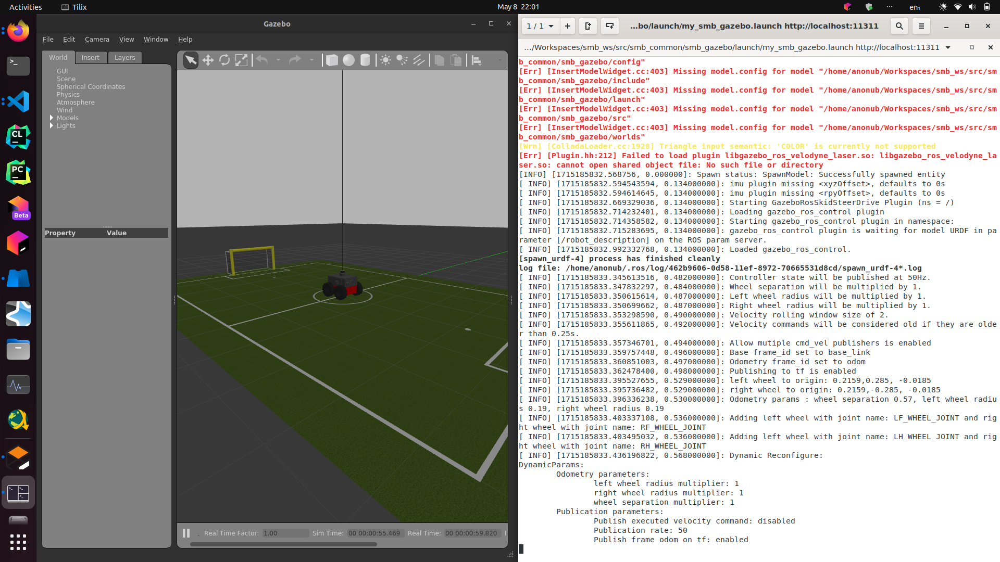
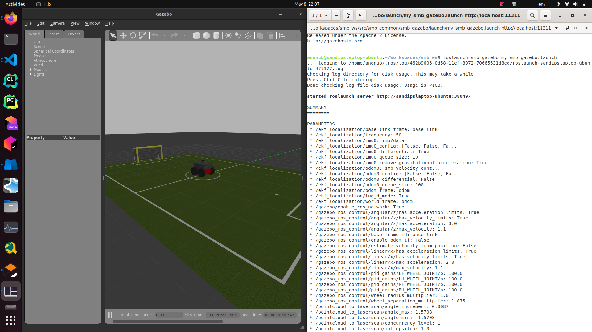

# Course 1

## Lecture Notes for Course 1

The very basic ROS Commands(ROS Master, Nodes, Topics):

```bash
#ROS Master
#Starting a ROS Master
roscore

#ROS Nodes
#Run a ROS Node
rosrun <package_name> <node_name>
#See the list of all the Active Nodes
rosnode list
#Info about a Node
rosnode info <node_name>

#ROS Topics
#List of active topics
rostopic list
#Print the messages being published to a topic
rostopic echo /<topic>
#Info about a topic
rostopic info /<topic>
#Analyze the frequency of messages published to a topic
rostopic hz /<topic>

#ROS Messages
#each topic has a unique 'type' of message associated with it
#each message type is/can be described by a *.msg(much like C/C++ Structures) file
#check the type of a topic
rostopic type /<topic>
#publish a message to a topic
rostopic pub /<topic> <type> <data>
```

Example output of `rostopic hz /chatter` run after running the example C++ talker on another terminal Tab


An example *.msg file(a.k.a. "Message type") composed of simpler message types

```plaintext
#geometry_msgs/PoseStamped.msg

std_msgs/Header header
 uint32 seq
 time stamp
 string frame_id
geometry_msgs/Pose pose
 geometry_msgs/Point position
  float64 x
  float64 y
  float64 z
 geometry_msgs/Quaternion orientation
  float64 x
  float64 y
  float64 z
  float64 w
```

ROS Nodelets: \
Same concepts as ROS Nodes, but reduced communication overhead when running on the same \
machine, although a bit harder to implement

### ROS Workspace Environments and Catkin

```bash
#Loading own Workspace environment
cd /path/to/catkin/ws #typically ~/catkin_ws
source devel/setup.bash
#Checking workspace environment
echo $ROS_PACKAGE_PATH

#Bulding a Workspace
cd /path/to/catkin/ws
catkin build <package_name>
#Older, outdated alternative: catkin_make <package_name>
source devel/setup.bash

#Cleaning catkin workspace
cd /path/to/catkin/ws
catkin clean

#Checking catkin workspace
catkin config
#building Debug instead of Release
catkin build --cmake-args-DCMAKE_BUILD_TYPE=Debug
```

The ROS Launch command

```bash
roslaunch <package_name> <name_of_launchfile>.launch
#With an argument:
roslaunch <package_name> <name_of_launchfile>.launch <arg_name>:=<value>
```

Example output after launching the `ros_package_template` file as instructed in the course


ROS Launch files(typical structure)

```xml
<launch>
    <node name="listener" pkg="roscpp_tutorials" type="listener" output="screen"/>
    <node name="talker" pkg="roscpp_tutorials" type="talker" output="screen"/>
</launch>
```

NOTE:

1. 'output' attribute specifies where to output log messages("screen" means console, "log" means log file)
2. Be careful about the 'self-closing tags'

Another launch file(can be used to launch a World in Gazebo) \
that has launch parameters('arg's) enabled

```xml
<?xml version="1.0"?>
<launch>
  <arg name="use_sim_time" default="true"/>
  <arg name="world" default="gazebo_ros_range"/>
  <arg name="debug" default="false"/>
  <arg name="physics" default="ode"/>

  <group if="$(arg use_sim_time)">
    <param name="/use_sim_time" value="true" />
  </group>

  <include file="$(find gazebo_ros)/launch/empty_world.launch">
    <arg name="world_name" value="$(find gazebo_plugins)/test/test_worlds/$(arg world).world"/>
    <arg name="debug" value="$(arg debug)"/>
    <arg name="physics" value="$(arg physics)"/>
  </include>
</launch>
```

Note:

1. Include other launch files with `<include>`
2. pass arguments to included launch files using `<arg>`
3. `<group>` with `if` attribute can be used as if-statements
4. Use value of arguments as `$(arg <arg_name>)`
5. Find system path to other packages using `$(find <package_name>)`

Running gazebo with provided ROS Interface

```bash
rosrun gazebo_ros gazebo
```

## Exercises

### Part 1

```bash
mkdir -p  ~/Workspaces/smb_ws/src
cd ~/Workspaces/smb_ws/
catkin init
cd src
ln -s ~/git/smb_common/
sudo apt-get install ros-noetic-hector-gazebo-plugins
catkin build smb_gazebo
```

Screenshot of the `catkin build` command: \


### Part 2

```bash
source ../devel/setup.bash
sudo apt-get install -y ros-noetic-velodyne-description
roslaunch smb_gazebo smb_gazebo.launch
```

Launched Gazebo Window: \


List of Nodes(`rosnode list`):

```plaintext
/base_controller_spawner
/gazebo
/gazebo_gui
/rosout
/smb_robot_state_publisher
```

List of Topics(`rostopic list`):

```plaintext
/clock
/cmd_vel
/gazebo/link_states
/gazebo/model_states
/gazebo/parameter_descriptions
/gazebo/parameter_updates
/gazebo/performance_metrics
/gazebo/set_link_state
/gazebo/set_model_state
/gazebo_ros_control/pid_gains/LF_WHEEL_JOINT/parameter_descriptions
/gazebo_ros_control/pid_gains/LF_WHEEL_JOINT/parameter_updates
/gazebo_ros_control/pid_gains/LH_WHEEL_JOINT/parameter_descriptions
/gazebo_ros_control/pid_gains/LH_WHEEL_JOINT/parameter_updates
/gazebo_ros_control/pid_gains/RF_WHEEL_JOINT/parameter_descriptions
/gazebo_ros_control/pid_gains/RF_WHEEL_JOINT/parameter_updates
/gazebo_ros_control/pid_gains/RH_WHEEL_JOINT/parameter_descriptions
/gazebo_ros_control/pid_gains/RH_WHEEL_JOINT/parameter_updates
/imu0
/imu0/accel/parameter_descriptions
/imu0/accel/parameter_updates
/imu0/bias
/imu0/rate/parameter_descriptions
/imu0/rate/parameter_updates
/imu0/yaw/parameter_descriptions
/imu0/yaw/parameter_updates
/joint_states
/odom
/rosout
/rosout_agg
/smb_velocity_controller/cmd_vel
/smb_velocity_controller/odom
/smb_velocity_controller/parameter_descriptions
/smb_velocity_controller/parameter_updates
/tf
/tf_static
```

List of topics that were continuously being published with their approximate frequency(number of messages published in each second) found out using the `rostopic hz` command

```plaintext
/clock: 1000
/gazebo/link_states: 1000
/gazebo/model_states: 1000
/gazebo/performance_metrics: 5
/imu0: 390
/imu0/bias: 390
/joint_states: 50
/odom: 100
/smb_velocity_controller/odom/: 50
/tf: 100
```

All the other topics were either not publishing any messages at all or only sending one message at the start of a subscription(found out using the `rostopic echo` command)

Screenshot of `rqt_graph`: \


### Task 3

```bash
rostopic pub -r 10 /cmd_vel geometry_msgs/Twist  '{linear:  {x: 0.1, y: 0.0, z: 0.0}, angular: {x: 0.0,y: 0.0,z: 0.0}}'
```

Note: \
The `-r` flag enables repetitive publishing of the message at a certain frequency(10 Hz in my case)



### Task 4

```bash
cd ~/git
git clone https://github.com/ros-teleop/teleop_twist_keyboard
cd ~/Workspaces/smb_ws/src/
ln -s ~/git/teleop_twist_keyboard/
catkin build teleop_twist_keyboard
source ../devel/setup.bash
rosrun teleop_twist_keyboard teleop_twist_keyboard.py
```

The aforementioned script will Clone, Compile and Run the `teleop_twist_keyboard` package \
After running it, I'm able to control my robot using the keyboard \
The following command and its output verifies that the package was built from source \


Controlling the robot using my keyboard \


### Task 5

```bash
code ~/Workspaces/smb_ws/src/smb_common/smb_gazebo/launch/my_smb_gazebo.launch #creating the launch file
roslaunch smb_gazebo my_smb_gazebo.launch
```

The `my_smb_gazebo.launch` file:

```xml
<?xml version="1.0" encoding="utf-8"?>

<launch>
    <include file="$(find smb_gazebo)/launch/smb_gazebo.launch">
        <arg name="world_file" value="worlds/robocup14_spl_field.world"/>
    </include>
</launch>
```

Screenshots after launching: \
 \

