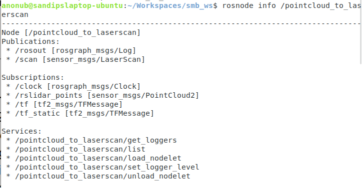

# Course 2

## Lecture Notes for Course 2

### Create skeleton of a new package

```bash
catkin_create_pkg <package_name> {<dependencies>}
```

### An example `package.xml` file

```xml
<?xml version="1.0"?>
<package format="2">
    <name>ros_package_template</name>
    <version>0.1.0</version>
    <description>A ROS package that...</description>
    <maintainer email="sd13535@outlook.com">Sandip Das</maintainer>
    <license>BSD</license>
    <url type="website">https://github.com/OWNER/REPO</url>
    <author email="sd13535@outlook.com">Sandip Das</maintainer>
    
    <buildtool_depend>catkin</buildtool_depend>
    
    <depend>roscpp</depend>
    <depend>std_msgs</depend>
    
    <build_depend>message_generation</build_depend>
    <build_export_depend>cv_bridge</build_export_depend>
</package>
```

usually contains the following:

- Package name, Version Number
- Authors, maintainers
- Dependencies

### An example `CMakeLists.txt` for a ROS Project

```cmake
cmake_minimum_required(VERSION 3.10.2)
project(ros_package_template)

#C++17 and later not officially compatible with ROS
#So, use 14 or 11
set(CMAKE_CXX_STANDARD 14)
set(CMAKE_CXX_STANDARD_REQUIRED TRUE)

# Find and include catkin libraries as dependencies
find_package(catkin REQUIRED COMPONENTS
        roscpp
        sensor_msgs
        )
#...
```

```cmake
#bit more complicated CMakeLists.txt
cmake_minimum_required(VERSION 3.10.2)
project(smb_highlevel_controller)

set(CMAKE_CXX_STANDARD 14)
set(CMAKE_CXX_STANDARD_REQUIRED TRUE)

find_package(catkin REQUIRED COMPONENTS
        roscpp
        sensor_msgs
        ) #must be identical to package.xml

catkin_package(
        INCLUDE_DIRS include
        #LIBRARIES: {libraries created in this project}
        CATKIN_DEPENDS roscpp sensor_msgs #dependent projects also need
        #DEPENDS: {system dependencies rather than catkin dependencies(e.g. roscpp,
                #sensor_msgs etc.} that dependent packages also need
)

include_directories(include ${catkin_INCLUDE_DIRS})

add_executable(${PROJECT_NAME}
        src/${PROJECT_NAME}_node.cpp
        src/SmbHighlevelController.cpp
)

target_link_libraries(${PROJCT_NAME} ${catkin_LIBRARIES})
```

### The ROS C++ Client Library `roscpp`

Essential components of the C++ client library:

- Initialization and spinning
- Node handle
- Logging
- Subscriber/Publisher
- Parameters
- Discussed in course 4:
- Services
- Actions
- Time

### `hello_world.cpp`

An example Node that prints text to stdout(and a few other places)

```cpp
#include <ros/ros.h>

int main(int argc, char* argv[])
{
  ros::init(argc, argv, "hello_world");
  ros::NodeHandle nodeHandle;
  ros::Rate loopRate(10);
  
  unsigned int count = 0;
  while (ros::ok()) {
    ROS_INFO_STREAM("Hello World" << count);
    ros::spinOnce();
    loopRate.sleep();
    count++;
  }
  
  return 0;
}
```

**Node Handle**: The node handle is the access point for communications with the ROS system (topics, services, parameters)

There are four main types of NodeHandle

| | Type | Example | what `topic` will resolve to if the node (called `node`) is in `namespace`|
|-|------|---------|---------------------------------------------------------------------------|
| Recommended | Default(public) node handle | `nh_ = ros::NodeHandle();` | `/namespace/topic` |
| Recommended | Private node handle | `nh_private = ros::NodeHandle("~");` | `/namespace/node/topic` |
| Not Recommended | Namespaced node handle | `nh_eth_ = ros::NodeHandle("eth")` | `/namespace/eth/topic` |
| Not Recommended | Global node handle | `nh_global_ = ros::NodeHandle("/")` | `/topic` |

**Logging**: It's a mechanism for logging human readable text from nodes in the console and to log files

- `ROS_INFO_STREAM()` has usage similar to `std::cout`  e.g. `ROS_INFO_STREAM("Result: "<<result);`
- `ROS_INFO()` has usage similar to `printf` e.g. `ROS_INFO("Result: %d", result);`
- Logs are sent to: Console, log file and `/rosout` topic
- There are different severity levels
- Further features: conditional, throttled, delayed logging
- **Note**: in order to see logs in stdout, set `output` parameter of node to `screen` in `*.launch` file

#### Severity levels in Logging

- There are five severity levels of Logging: `DEBUG`, `INFO`, `WARN`, `ERROR` and `FATAL`
- In all five severity levels, logs are sent to both `/rosout` topic and log files
- In `DEBUG` and `INFO`, console logs are seen in `stdout`
- In `WARN`, `ERROR` and `FATAL` console logs are seen in `stderr`

Summary:

|           | `DEBUG` | `INFO` | `WARN` | `ERROR` | `FATAL` |
|-----------|---------|--------|--------|---------|---------|
| `stdout`  | :heavy_check_mark: | :heavy_check_mark: | | | |
| `stderr`  |                    |                    | :heavy_check_mark: | :heavy_check_mark: | :heavy_check_mark: |
| Log file  | :heavy_check_mark: | :heavy_check_mark: | :heavy_check_mark: | :heavy_check_mark: | :heavy_check_mark: |
| `/rosout` | :heavy_check_mark: | :heavy_check_mark: | :heavy_check_mark: | :heavy_check_mark: | :heavy_check_mark: |

### `listener.cpp`

An example Node that subscribes to a Topic, and Logs all the messages being published to that topic(in this case, `/chatter`)

```cpp
#include <ros/ros.h>
#include <std_msgs/String.h>

void chatterCallback(const std_msgs::String& msg)
{
  ROS_INFO_STREAM("I heard: [" << msg.data << "]");
}

int main(int argc, char* argv[])
{
  ros::init(argc, argv, "listener");
  ros::NodeHandle nodeHandle;
  
  ros::Subscriber subscriber = nodeHandle.subscribe("chatter", 10, chatterCallback);
  ros::spin();
  return 0;
}
```

Note:

1. during spinning, for every(if there are any) new message received, a Callback Function will be called, a Function Pointer to that function is passed as the 3rd argument while subscribing(using the `nodeHandle.subscribe` function)
2. `ros::spin()` will keep processing incoming messages, unlike `ros::spinOnce()`, till the node is shut down

Note carefully:

1. the only argument of the Callback Function must be a `const` reference(e.g. `const std_msgs::String& msg`)
2. Code for declaring a Subscriber object: `ros::Subscriber subscriber = nodeHandle.subscribe(<topic>, <queue_size>, <callback_function>);`
3. when `queue_size` is exceeded, newer messages will be ignored
4. If we want a member function(a.k.a. method) of a class to be the callback function, we declare a Subscriber object using `ros::Subscriber subscriber = nodeHandle.subscribe(<topic>, <queue_size>, &<ClassName>::<methodName>, &<objectName>);` where `<objectName>` needs to be substituted by `this`(simply because it is the pointer to the object in this case) in the case where `<methodName>` is a member of the Node class(i.e. the class declared and defined in `MyPackage.cpp` and `MyPackage.hpp` as shown below) itself

### `talker.cpp`

An example Node that periodically publishes messages to a specific topic(in this case, `/chatter`)

```cpp
#include <ros/ros.h>
#include <std_msgs/String.h>

int main(int argc, char* argv[]) {
  ros::init(argc, argv, "talker");
  ros::NodeHandle nh;
  ros::Publisher chatterPublisher = nh.advertise<std_msgs::String>("chatter", 1);
  ros::Rate loopRate(10);
  
  unsigned int count = 0;
  while (ros::ok()) {
    std_msgs::String message;
    message.data = "hello world " + std::to_string(count);
    ROS_INFO_STREAM(message.data);
    chatterPublisher.publish(message);
    ros::spinOnce();
    loopRate.sleep();
    count++;
  }
  return 0;
}
```

Note:

1. Creating Publisher object: `ros::Publisher publisher = nodeHandle.advertise<message_type>(__topic__, __queue_size__);`
2. Assigning content to the message `message.data = "hello world" + std::to_string(count);`
3. Publishing the message: `__publisher__.publish(__message__);`

### OOP in programming ROS Packages

Typical structure of the source files for a Node in a ROS Package written in C++ (atleast the complex ones, where OOP can be helpful):

- `my_package_node.cpp`: has the main function only which involves mostly boilerplate code, calling the methods of the separate class that is associated with the node(known as the Node class), it doesn't implement any intricacies of the Node at all \
- `MyPackage.hpp` and `MyPackage.cpp`: Completely implements (except possibly a few complicated Algorithms) the Node class(provides the ROS interface i.e. Subscribers, Parameters, timers etc.) \
- `Algorithm.hpp` and `Algorithm.cpp`: Possibly a few complicated algorithms that were not implemented in `MyPackage.cpp`

### The ROS Parameter Server

- Used by Nodes to store Parameters and retrieve them at runtime
- Can be defined in either the project's `*.launch` files or in separate `*.yaml` files
- Best used for information that won't change during Runtime(e.g. the Number of Cameras)

Here is an example where a separate `config.yaml` file is used:

`config.yaml`:

```yaml
camera:
    left:
    name: left_camera
    exposure: 1
  right:
    name: right_camera
    exposure: 1.1
```

`package.launch`:

```xml
<launch>
  <node name="name" pkg="package" type="node_type">
    <rosparam command="load" file="$(find package)/config/config.yaml" />
  </node>
</launch>
```

#### Some useful terminal commands

```bash
#list all parameters
rosparam list
#get the value of a parameter
rosparam get <parameter_name>
#set the value of a parameter
rosparam set <parameter_name> <value>
```

Sometimes `rosparam set` would require a restart of one or more nodes

#### Usage in C++ programs

- in C++ programs, one could use `nodeHandle.getParam("<parameter_name>", <variable>)` to get parameters(the returned value will be put into the variable `<variable>`)
- it returns a `bool` value: `true` if the parameter was found, otherwise `false`
- `"<parameter_name>"` can either be relative(to the node handle) or global, just like path to Linux directories. Examples:

```cpp
nodeHandle.getParam("/package/camera/left/exposure", variable) //global parameter name
nodeHandle.getParam("camera/left/exposure", variable) //relative parameter name
```

- we typically use a private node handle for parameters i.e. `ros::NodeHandle("~")`

A good example snippet receiving the value of a parameter:

```cpp
ros::NodeHandle nodeHandle("~");
std::string topic;
if (!nodeHandle.getParam("topic", topic)) {
  ROS_ERROR("Could not find topic parameter!");
}
ROS_INFO_STREAM("Read topic: " << topic);
```

### rviz

Basic info:

- An Interactive tool that visualizes 3D information in messages coming from topics(by subscribing to them) and publish user information (produced by the Interactive components) to various topics
- The user interface is highly configurable(e.g. Different camera views: orthographic, top-down etc.) and extensible with plugins. A net setup thus formed due to a certain set of configurations can be saved and reloaded, possibly by other users

Saving the current configuration is as pressing `Ctrl+S`

Basic terminal commands:

```bash
#run rviz
rviz
```

#### Example: Visualizing Point Clouds

These specific things should be carefully selected

1. Frame in which the data is displayed
2. Topic from where the messages containing the data come
3. Size(m) and other display options

Note:

1. The selected frame must be one that exists
2. `\scan` won't be published unless a Node subscribes during launch (such a node will be built in the exercise)

## Exercises

### Part 1

Initializing the package:

```bash
cd ~/git
catkin_create_pkg smb_highlevel_controller roscpp sensor_msgs
cd smb_highlevel_controller/
git init
```

The package is then developed and tracked using git, the repo is available [here](https://github.com/real-Sandip-Das/smb_highlevel_controller)

### Part 2

(Not required for me)

### Part 3

Done already!

### Part 4

### Part 10



<!--TODO: add this in the right place: -->

```bash
sudo apt-get install -y ros-noetic-pointcloud-to-laserscan
sudo apt-get install -y ros-noetic-velodyne-simulator #installs both ros-noetic-velodyne-description & ros-noetic-velodyne-gazebo-plugins reference:http://wiki.ros.org/velodyne_simulator?distro=noetic
```
<!-- http://docs.ros.org/en/noetic/api/sensor_msgs/html/msg/PointCloud2.html resources for number of points task --->