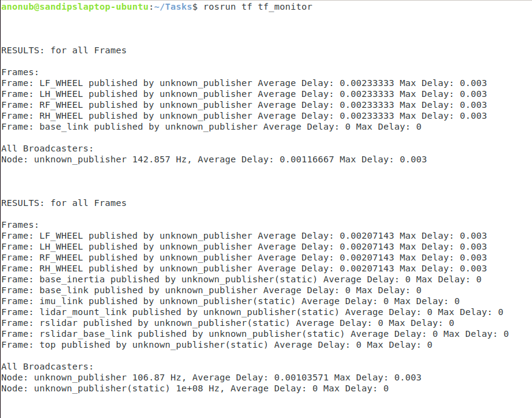
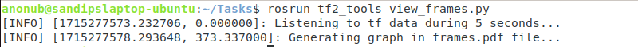
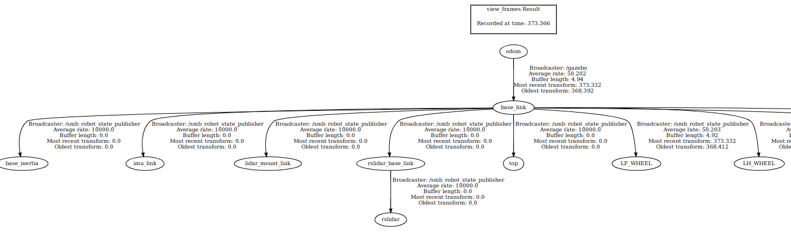

# Course 3

## Lecture Notes

Topics needed to cover:

1. TF transformation system
2. rqt interface

### TF Transformation System

- Tool for keeping track of coordinate frames over time
- Available as the topics: `/tf` and `/tf_static`

#### Basic TF usage

```bash
#Print info about the current Transform Tree
rosrun tf tf_monitor

#Print info about the transform between two frames
rosrun tf tf_echo <source_frame> <target_frame>

#Generating visual graph of the Transform Tree
rosrun tf view_frames #Currently not working in ROS Noetic
rosrun tf2_tools view_frames.py #had to run: sudo apt-get -y install ros-noetic-tf2-tools
```

Example outputs after launching `smb_gazebo`:

`rosrun tf tf_monitor`: \


`rosrun tf2_tools view_frames.py`: \
 \


#### TF Transform Listener C++ API

Create a TF Listener to fill up a buffer:

```cpp
tf2_ros::Buffer tfBuffer;
tf2_ros::TransformListener tfListener(tfBuffer);
```

Note:

- make sure that the `tfListener` object is scoped to persist, otherwise its cache will be unable to fill and almost every query will fail
- A common method is to make the `tfListener` object a member variable of a class

To lookup transformations, use:

```cpp
geometry_msgs::TransformStamped transformStamped
= tfBuffer.lookupTransform(<target_frame_id>, <source_frame_id>, <time>);
```

- `<target_frame_id>` and `<source_frame_id>` are strings
- for latest transform, use `ros::Time(0)` as `<time>`;
- ROS Time is introduced in Lecture 4

Example code that uses this functionality

##### `tflistener_example.cpp`

```cpp
#include <ros/ros.h>
#include <tf2_ros/transform_listener.h>
#include <geometry_msgs/TransformStamped.h>

int main(int argc, char** argv) {
  ros::init(argc, argv, "tf2_listener");
  ros::NodeHandle nodeHandle;
  tf2_ros::Buffer tfBuffer;
  tf2_ros::TransformListener tfListener(tfBuffer);
  
  ros::Rate rate(10.0);
  while (nodeHandle.ok()) {
    geometry_msgs::TransformStamped transformStamped;
    try {
      transformStamped = tfBuffer.lookupTransform("base", "odom", ros::Time(0));
    } catch (tf2::TransformException &exception) {
      ROS_WARN("%s", exception.what());
      ros::Duration(1.0).sleep();
      continue;
    }
    rate.sleep();
  }
  return 0;
}
```

### `rqt` User Interface

Overview:

- User interface based on Qt
- Custom interfaces can be setup
- Lots of plugins exist
- Simple to write own plugins

Basic terminal commands:

```bash
#Two ways of running rqt:
rosrun rqt_gui rqt_gui
rqt
```

#### Examples of preexisting plugins

##### `rqt_image_view`

used to Visualize images

```bash
#run rqt_image_view
rosrun rqt_image_view rqt_image_view
#then select the topic where rgb images are being published
```

##### `rqt_multiplot`

used to Visualize numeric values in 2D plots

```bash
#Install if it isn't installed already
sudo apt-get install -y ros-noetic-rqt-multiplot
#run rqt_multiplot
rosrun rqt_multiplot rqt_multiplot
```

##### `rqt_graph`

used to Visualize the ROS Computation graph

```bash
#run rqt_graph
rosrun rqt_graph rqt_graph
```

##### `rqt_console`

used to View and Filter Logs that are being sent to the console

```bash
#run rqt_console
rosrun rqt_console rqt_console
```

##### `rqt_logger_level`

used to Configure the logging levels of ROS Nodes

```bash
#run rqt_logger_level
rosrun rqt_logger_level rqt_logger_level
```

## Exercises

### Part 1

Since, there are still a lot of unresolved error/warning messages shown while launching `smb_gazebo`, `rosdep` was used to install all the remaining dependencies of the project.

The following commands can be used to do so

```bash
# cd into the root workspace folder before executing the following commands
rosdep update && rosdep install --from-paths src --ignore-src --rosdistro=$ROS_DISTRO -y
# the previous command installed ros-noetic-interactive-marker-twist-server, ros-noetic-joint-trajectory-controller,
# ros-noetic-robot-localization, ros-noetic-twist-mux
```

Then the `smb_common_v2.zip` archive was extracted, placed into the `~/git` folder, and symlink to this folder was created from: `~/Workspaces/smb_ws/src/smb_common/`

Then, `catkin build smb_gazebo` was executed

### Part 2

Changing the `world_file` argument solves the problem

```xml
    <include file="$(find smb_gazebo)/launch/smb_gazebo.launch">
        <arg name="laser_enabled" value="true" />
        <arg name="world_file" value="$(find smb_highlevel_controller)/worlds/singlePillar.world" />
    </include>
```

### Part 3

In the Laser Scan, the closest point will be taken as the position of the pillar

```cpp
void SmbHighlevelController::topicCallback(const sensor_msgs::LaserScan& message)
{
  float smallest_distance = message.range_max;
  int index_of_smallest_distance;
  int index = 0;
  for (float range: message.ranges) {
    if ((message.range_min <= range) && (range <= message.range_max)) {
      smallest_distance = std::min(smallest_distance, range);
      index_of_smallest_distance = index;
    }
    index++;
  }

  /// finds out the position of the pillar using the closest point in the laser scan
  pillar_pos_x_ = smallest_distance*std::cos(message.angle_min+message.angle_increment*index_of_smallest_distance);
  pillar_pos_y_ = smallest_distance*std::sin(message.angle_min+message.angle_increment*index_of_smallest_distance);

  ROS_INFO_STREAM("Minimum Range: " << smallest_distance);
}
```

### Part 4

Modified the C++ source to do so

### Part 5

According to [this](https://youtu.be/qIpiqhO3ITY) tutorial, I should take the y-coordinate of the relative position of the Pillar as the error term \
and use it to send a proportional angular velocity(along z axis) command \
with a constant linear velocity for moving forward

Using this hint, I created a Proportional controller that will drive the robot to the pillar

```cpp
  /// finds out the position of the pillar using the closest point in the laser scan
  double pillarAngularPos_ = message.angle_min+message.angle_increment*index_of_smallest_distance;

  // double pillar_pos_x_ = smallest_distance*std::cos(pillarAngularPos_);
  double pillar_pos_y_ = smallest_distance*std::sin(pillarAngularPos_);

  // P controller implementation
  geometry_msgs::Twist command;
  command.angular.x = 0;
  command.angular.y = 0;
  command.angular.z = k_p_*pillar_pos_y_;
  command.linear.x = constLinVel_;
  command.linear.y = 0;
  command.linear.z = 0;

  publisherCmdVel_.publish(command);
```

the parameters `k_p` and `const_lin_vel` (in `config/config.yaml`) respectively can be used to modify the linear velocity and the Proportional gain respectively

Also, the launch file has been modified accordingly to make the pillar visible

```xml
    <include file="$(find smb_gazebo)/launch/smb_gazebo.launch">
        <arg name="laser_enabled" value="true" />
        <arg name="world_file" value="$(find smb_highlevel_controller)/worlds/singlePillar.world" />
        <arg name="laser_scan_min_height" value="-0.2"/>
        <arg name="laser_scan_max_height" value="1.0"/>
    </include>
```

### Part 6

Already done in Exercise 2

### Part 7

Already done in Exercise 2

### Part 8
